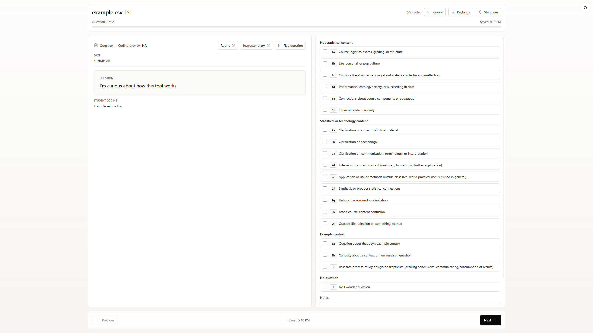

# Curiosity Coding Interface

A local-first research tool for coding student responses collected as part of the [Curiosity research project](https://www.visruth.com/posters/BCSM%202026%20Curiosity%20Poster.svg).

The application supports structured qualitative coding while keeping research data on the user's device. Processing occurs locally in the browser or desktop application; there is no backend, no data ever leaves your laptop.

The interface is available as a [web application](https://cc.visruth.com/) and as desktop builds for macOS and Windows.

<picture>
  <source media="(prefers-color-scheme: dark)" srcset=".github/assets/screenshot-dark.png">
  <source media="(prefers-color-scheme: light)" srcset=".github/assets/screenshot-light.png">
  
</picture>

## Installation

For desktop use, download the latest release from the [Releases page](https://github.com/VisruthSK/Curiosity-Coding-Frontend/releases/latest).

### macOS

```bash
curl -fsSL https://raw.githubusercontent.com/VisruthSK/Curiosity-Coding-Frontend/main/install-macos.sh | bash
```

The macOS build is unsigned. The script installs the right version for your Mac and applies the local unsigned-app fixes.

#### Manual Installation

Alternatively, you can manually install the app. Pick the right `.dmg`:

* Apple Silicon: `Curiosity-Coding-Interface-macOS-Apple-Silicon.dmg`
* Intel: `Curiosity-Coding-Interface-macOS-Intel.dmg`

To check your Mac type, open Apple menu -> About This Mac.

* If it says `Chip: Apple M1`, `M2`, etc. use Apple Silicon.
* If it says `Processor: Intel`, use Intel.

Open the `.dmg`, then drag `Curiosity Coding Interface.app` into Applications. If macOS says the app is damaged, run:

```sh
sudo codesign --force --deep --sign - "/Applications/Curiosity Coding Interface.app"
sudo xattr -dr com.apple.quarantine "/Applications/Curiosity Coding Interface.app"
```

### Windows

Download and run:

```txt
Curiosity-Coding-Interface-Windows.exe
```

